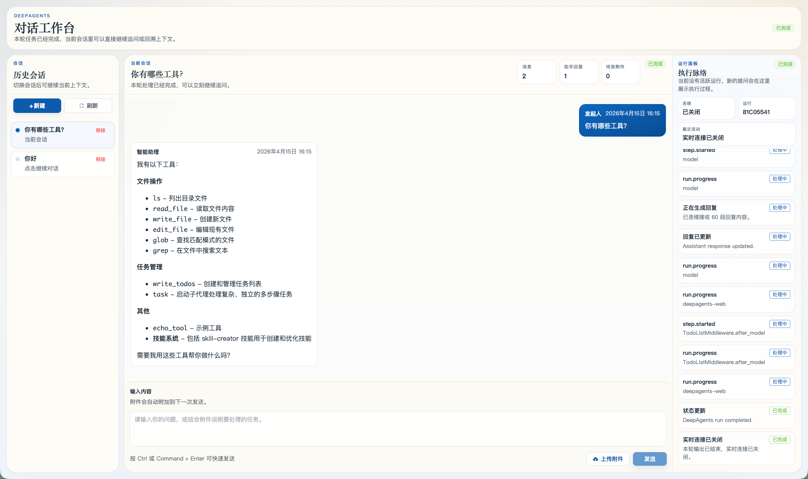

# open_deepagents

`open_deepagents` is a full-stack scaffold for building a DeepAgents-powered web workspace.

It is designed as a practical foundation rather than a finished product. The repository already supports local end-to-end runs, administrator authentication, session management, uploads, run streaming, and DeepAgents runtime integration, while still leaving room for project-specific extensions.

Chinese documentation: [README_CH.md](README_CH.md)



## Architecture

The repository is split into two main application lanes:

- `backend/`: a FastAPI service that owns authentication, persistence, uploads, run orchestration, and DeepAgents runtime integration.
- `frontend/`: a Vue 3 + Vite console for login, session management, chat, attachments, streamed events, and run timelines.

The current request flow is:

1. An administrator signs in from the frontend.
2. The frontend stores the bearer token and calls the backend API.
3. A user creates or reuses a session.
4. The user uploads files and submits a prompt.
5. The backend creates a run, stores the user message, and starts a DeepAgents runtime.
6. Runtime events are bridged into the frontend SSE envelope format.
7. The frontend updates the chat transcript and run timeline from the streamed events.

## Repository layout

```text
.
├── backend/
│   ├── app/                          FastAPI application code
│   ├── deepagents_integration/       Thin DeepAgents runtime bridge
│   ├── extensions/                   Tool / middleware / runtime hook / skill templates
│   ├── prompts/                      Project-managed runtime prompt
│   └── tests/                        Backend tests
├── frontend/
│   └── src/
│       ├── components/               Vue UI components
│       ├── lib/copy.js               Centralized user-facing UI copy
│       ├── store/                    Client state containers
│       └── api/                      Backend HTTP/SSE client
├── packages/
│   ├── contracts/                    Shared contracts
│   └── extension-manifest.template.json
├── docs/                             Project documentation and screenshots
├── tests/                            Repository-level tests
└── verification/                     Audit and contract checks
```

## Features

### Backend

- FastAPI app factory and `/health` health check
- Single-admin bearer-token authentication
- CRUD for sessions, messages, and uploads
- DeepAgents run creation, runtime event bridging, and SSE streaming
- Local file upload storage
- Configurable tools, middleware, runtime hooks, skills, memory, and sandbox backends
- Environment-controlled DeepAgents built-in tool allow/block filtering
- SQLite-first local development with MySQL-compatible models

### Frontend

- Admin login page
- Session list and session switching
- Chat workspace with file attachments
- Markdown and Mermaid rendering
- SSE-driven run status streaming
- Timeline views for run steps, tools, skills, and sandbox events
- Centralized UI copy in `frontend/src/lib/copy.js` for lightweight wording customization

### Engineering support

- Shared SSE contract definitions
- Repository audit checks
- Backend, frontend, and contract tests
- Extension templates and architecture notes

## Requirements

- Python `3.11` or `3.12`
- [uv](https://docs.astral.sh/uv/) for backend dependency management
- Node.js `18+`
- npm
- A model source:
  - a standard model string such as `openai:gpt-5.4`, or
  - an OpenAI-compatible custom endpoint

## Quick start

### 1. Configure backend environment variables

Copy the template:

```bash
cp backend/.env.example backend/.env
```

Key points:

- The backend only reads `backend/.env`.
- If `DATABASE_URL` is unset, the backend falls back to `sqlite+pysqlite:///./data/backend.db`.
- The runtime system prompt is stored in [backend/prompts/deepagents-system-prompt.md](backend/prompts/deepagents-system-prompt.md), not in `.env`.
- If `CUSTOM_API_KEY`, `CUSTOM_API_URL`, and `CUSTOM_API_MODEL` are all set, the backend uses that OpenAI-compatible endpoint and `CUSTOM_API_MODEL` takes precedence over `DEEPAGENTS_MODEL`.

### 2. Install backend dependencies

```bash
cd backend
uv sync --group dev
```

### 3. Install frontend dependencies

```bash
cd frontend
npm install
```

### 4. Start the backend

```bash
cd backend
uv run uvicorn app.main:app --reload
```

Default URLs:

- API: `http://127.0.0.1:8000/api`
- health check: `http://127.0.0.1:8000/health`
- OpenAPI: `http://127.0.0.1:8000/docs`

### 5. Start the frontend

```bash
cd frontend
npm run dev
```

By default the frontend talks to the backend through `/api`. Override it with `VITE_API_BASE_URL` if needed.

### 6. Sign in

Default credentials come from `backend/.env`:

- `ADMIN_USERNAME`
- `ADMIN_PASSWORD`

## Configuration guide

### Core backend settings

Common settings in `backend/.env`:

| Variable | Purpose |
| --- | --- |
| `APP_NAME` | FastAPI application name |
| `API_PREFIX` | API prefix, default `/api` |
| `DATABASE_URL` | Full database connection string |
| `ADMIN_EMAIL` | Optional admin email |
| `ADMIN_USERNAME` | Admin username |
| `ADMIN_PASSWORD` | Admin password |
| `ADMIN_TOKEN_SECRET` | JWT signing secret |
| `ADMIN_TOKEN_EXPIRE_MINUTES` | Token expiry in minutes |
| `ADMIN_AUTH_ENABLED` | Set `false` to disable the login gate for local deployments |
| `CORS_ALLOWED_ORIGINS` | Comma-separated frontend origins |
| `UPLOAD_STORAGE_DIR` | Upload directory |
| `MAX_UPLOAD_SIZE_BYTES` | Per-file upload limit |
| `DEEPAGENTS_MODEL` | Default model configuration |
| `DEEPAGENTS_AGENT_NAME` | Runtime agent name |
| `DEEPAGENTS_DEBUG` | Enable DeepAgents debug mode |
| `DEEPAGENTS_TOOL_SPECS` | Tool extension entrypoints |
| `DEEPAGENTS_MIDDLEWARE_SPECS` | Middleware extension entrypoints |
| `DEEPAGENTS_RUN_INPUT_HOOK_SPECS` | Run-input hook entrypoints; leave empty for no prompt injection |
| `DEEPAGENTS_UPLOAD_HOOK_SPECS` | Upload hook entrypoints; leave empty for no upload enrichment |
| `DEEPAGENTS_BUILTIN_TOOLS` | Optional allowlist for DeepAgents built-in tools |
| `DEEPAGENTS_DISABLED_BUILTIN_TOOLS` | Optional blocklist for DeepAgents built-in tools |
| `DEEPAGENTS_SKILLS` | Skill directories |
| `DEEPAGENTS_MEMORY` | Extra memory / guidance files |
| `DEEPAGENTS_SANDBOX_*` | Sandbox backend configuration |

### OpenAI-compatible custom model settings

If all three required variables are present, the backend builds a `ChatOpenAI` client instead of passing `DEEPAGENTS_MODEL` through directly:

- `CUSTOM_API_KEY`
- `CUSTOM_API_URL`
- `CUSTOM_API_MODEL`

Optional variables:

| Variable | Purpose |
| --- | --- |
| `CUSTOM_API_TEMPERATURE` | Optional custom-model temperature. If unset or empty, the backend does not send a `temperature` field to `ChatOpenAI`. |
| `CUSTOM_API_DEFAULT_HEADERS` | Optional request headers for the custom endpoint. Recommended format: JSON object string. |

Recommended header format:

```dotenv
CUSTOM_API_DEFAULT_HEADERS={"HTTP-Referer":"https://app.example.com","X-Title":"open_deepagents"}
```

Backward-compatible fallback format is also accepted:

```dotenv
CUSTOM_API_DEFAULT_HEADERS=HTTP-Referer=https://app.example.com,X-Title=open_deepagents
```

`CUSTOM_API_URL` is normalized to the base API URL before client creation:

- if it ends with `/chat/completions`, that suffix is removed
- otherwise `/v1` is appended unless it is already present

### Default extension settings

`backend/.env.example` enables these sample extensions by default:

- `DEEPAGENTS_TOOL_SPECS=extensions.tools:TOOLS`
- `DEEPAGENTS_MIDDLEWARE_SPECS=extensions.middleware:MIDDLEWARE`
- `DEEPAGENTS_RUN_INPUT_HOOK_SPECS=extensions.runtime_hooks:RUN_INPUT_HOOKS`
- `DEEPAGENTS_UPLOAD_HOOK_SPECS=extensions.runtime_hooks:UPLOAD_HOOKS`
- `DEEPAGENTS_SKILLS=extensions/skills`
- `DEEPAGENTS_SANDBOX_KIND=state`
- `DEEPAGENTS_SANDBOX_ROOT_DIR=./data`

The backend normalizes `DEEPAGENTS_SKILLS=extensions/skills` to the DeepAgents
source path `/extensions/skills/` and routes that source to the on-disk project
directory, so skills remain discoverable even when the main runtime backend is
`state` or a sandbox rooted under `backend/data`.

Runtime hooks are configured from extension entrypoints. If the hook specs are
blank, uploaded files are still stored and bound to messages, but no attachment
prompt text or upload metadata enrichment is applied. The default starting point is:

```dotenv
DEEPAGENTS_RUN_INPUT_HOOK_SPECS=extensions.runtime_hooks:RUN_INPUT_HOOKS
DEEPAGENTS_UPLOAD_HOOK_SPECS=extensions.runtime_hooks:UPLOAD_HOOKS
```

Then edit files under [backend/extensions/runtime_hooks](backend/extensions/runtime_hooks). Run-input
hooks receive the current message plus resolved attachment metadata and can replace
the content handed to DeepAgents. Upload hooks run after storage and can add
metadata to `UploadRecord.extra`.

Built-in DeepAgents tools can be filtered without editing source:

```dotenv
# Keep only these built-in tools visible; custom tools are still passed through.
DEEPAGENTS_BUILTIN_TOOLS=write_todos,ls,read_file,glob,grep,task

# Hide host execution and write tools from the built-in suite.
DEEPAGENTS_DISABLED_BUILTIN_TOOLS=execute,write_file,edit_file
```

Known built-in names are `write_todos`, `ls`, `read_file`, `write_file`,
`edit_file`, `glob`, `grep`, `execute`, and `task`.

### Default sandbox permissions

Default sandbox permissions are enforced in code rather than left to documentation alone:

- operations: read-only
- allowed paths:
  - `backend/data`
  - `backend/extensions/skills`

These permission paths are normalized to DeepAgents-safe absolute strings, including Windows-safe slash normalization for drive-letter paths.

### Sandbox kinds and path model

The sandbox backend controls where DeepAgents filesystem and shell-like tools run:

| Kind | Use when | Boundary |
| --- | --- | --- |
| `state` | You want an in-memory DeepAgents workspace and no host shell execution. | No real project directory is exposed except routed skill/upload metadata paths. |
| `filesystem` | You want file tools against a real directory tree. | `DEEPAGENTS_SANDBOX_ROOT_DIR` is the filesystem root. |
| `local_shell` | You explicitly want `execute` to run host commands. | Commands run on the host; use only in trusted deployments. |
| `custom` | You provide your own backend factory. | Implemented by `DEEPAGENTS_SANDBOX_BACKEND_SPEC=module_or_path:factory`. |

Path fields in upload metadata:

- `storage_key`: relative path below `UPLOAD_STORAGE_DIR`, persisted in the DB.
- `upload_path`: absolute host path, useful when the backend has read permission to that location.
- `sandbox_path`: path relative to the configured sandbox root when the upload lives inside it.

If `DEEPAGENTS_SANDBOX_VIRTUAL_MODE=true`, sandbox paths are presented with a leading
slash, for example `/uploads/<session>/<file>`. If virtual mode is false, paths are
normal filesystem paths relative to the backend/sandbox root where the backend allows it.

### Uploaded file paths and sandbox visibility

When a user uploads a file, the backend persists it before the run starts:

- `UPLOAD_STORAGE_DIR` is the upload root. With the default settings it resolves to `backend/data/uploads`, even if the backend process is started from another working directory.
- Each file is written to `UPLOAD_STORAGE_DIR/<session_id>/<uuid>-<original-filename>`.
- `storage_key` is the relative suffix under `UPLOAD_STORAGE_DIR`, for example `session-123/2b6d...-notes.pdf`.
- The concrete on-disk path is `UPLOAD_STORAGE_DIR / storage_key`.

Runtime behavior:

- Before a run starts, the backend enriches each selected attachment with `upload_id`, `storage_key`, and `upload_path`.
- The runtime prompt tells the agent to use the provided upload path directly instead of asking the user to provide one again.
- The default sandbox read permissions already cover `backend/data`; if you move `UPLOAD_STORAGE_DIR` outside that tree, the backend automatically adds the custom upload directory to the runtime read-allowed paths.

## Backend API overview

### Admin auth

- `POST /api/admin/login`
- `GET /api/admin/me`

### Sessions

- `GET /api/sessions`
- `POST /api/sessions`
- `GET /api/sessions/{session_id}`
- `PATCH /api/sessions/{session_id}`
- `DELETE /api/sessions/{session_id}`

### Messages

- `GET /api/sessions/{session_id}/messages`
- `POST /api/sessions/{session_id}/messages`
- `GET /api/messages/{message_id}`
- `PATCH /api/messages/{message_id}`
- `DELETE /api/messages/{message_id}`

### Uploads

- `GET /api/sessions/{session_id}/uploads`
- `POST /api/sessions/{session_id}/uploads`
- `POST /api/uploads`
- `GET /api/uploads/{upload_id}`
- `GET /api/uploads/{upload_id}/content`

### Runs

- `POST /api/runs`
- `GET /api/runs/{run_id}`
- `GET /api/runs/{run_id}/stream`

## Extension points

The backend resolves extensions from configuration rather than hardcoding them.

### Tools and middleware

- Unified tool entrypoint: [backend/extensions/tools/__init__.py](backend/extensions/tools/__init__.py)
- Tool guide: [backend/extensions/tools/README.md](backend/extensions/tools/README.md)
- Tool template: [backend/extensions/tools/echo_tool.py](backend/extensions/tools/echo_tool.py)
- Unified middleware entrypoint: [backend/extensions/middleware/__init__.py](backend/extensions/middleware/__init__.py)
- Middleware guide: [backend/extensions/middleware/README.md](backend/extensions/middleware/README.md)
- Middleware template: [backend/extensions/middleware/audit_middleware.py](backend/extensions/middleware/audit_middleware.py)

Entrypoint format:

```text
path/to/file.py:OBJECT_NAME
```

Recommended pattern:

- add tool modules under `backend/extensions/tools/`
- export the aggregated `TOOLS` list from `backend/extensions/tools/__init__.py`
- add middleware modules under `backend/extensions/middleware/`
- export the aggregated `MIDDLEWARE` list from `backend/extensions/middleware/__init__.py`
- middleware can read run context with `runtime.context` in hooks such as
  `@before_agent`, or `request.runtime.context` in wrappers such as
  `@wrap_tool_call`

### Runtime hooks

- Hook template directory: [backend/extensions/runtime_hooks](backend/extensions/runtime_hooks)
- Unified entrypoint: [backend/extensions/runtime_hooks/__init__.py](backend/extensions/runtime_hooks/__init__.py)
- Example implementation: [backend/extensions/runtime_hooks/attachment_hooks.py](backend/extensions/runtime_hooks/attachment_hooks.py)

Configure hooks with:

```dotenv
DEEPAGENTS_RUN_INPUT_HOOK_SPECS=extensions.runtime_hooks:RUN_INPUT_HOOKS
DEEPAGENTS_UPLOAD_HOOK_SPECS=extensions.runtime_hooks:UPLOAD_HOOKS
```

`RUN_INPUT_HOOKS` functions receive a context with `session_id`, `run_id`, `role`,
`content`, `attachments`, and `is_current_run`. Return a string or
`{"content": "..."}` to replace the message content; return `None` to leave it as-is.

`UPLOAD_HOOKS` functions receive file metadata and the raw payload after storage.
Return a mapping to merge into upload `extra`; return `None` to leave it unchanged.

### Skills

- Skill template directory: [backend/extensions/skills](backend/extensions/skills)
- configured through `DEEPAGENTS_SKILLS`
- each skill must live in its own subdirectory with `SKILL.md`

Example structure:

```text
backend/extensions/skills/
  web-research/
    SKILL.md
    helper.py
```

### Memory

- configured through `DEEPAGENTS_MEMORY`

### Sandboxes

Supported sandbox kinds:

- `state`
- `filesystem`
- `local_shell`
- `custom`

See [docs/sandbox.md](docs/sandbox.md)
for path examples, upload visibility rules, and safety notes.

### Frontend copy customization

Most user-facing UI strings are collected in [frontend/src/lib/copy.js](frontend/src/lib/copy.js).
For simple product wording changes, edit that file first. Stores and major
components import from this module so copy changes do not require template spelunking.

## Development and verification

Backend checks are run from `backend/`. Typical commands:

```bash
uv run pytest
uv run mypy app
uv run ruff check .
```
