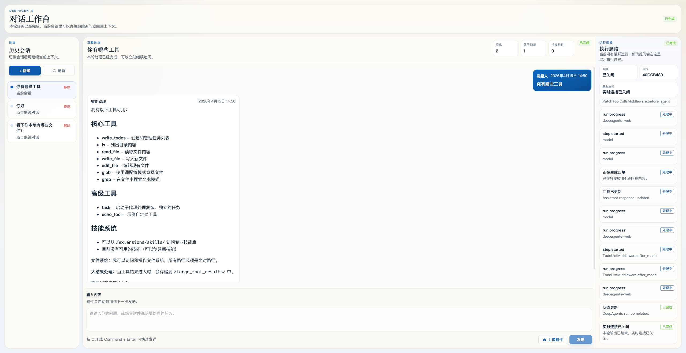

# open_deepagents

`open_deepagents` 是一个可运行的 DeepAgents Web 工作台脚手架。它提供
Agent 应用外壳：管理员登录、会话历史、文件上传、流式运行事件、Vue
聊天界面、模型选择、subagent 状态展示，以及可以直接改造的 agent 包。

English documentation: [README.md](README.md)



## 架构一眼看懂

```text
frontend/  Vue 3 控制台：登录、会话、聊天、附件、Mermaid、运行面板
backend/   FastAPI 服务：认证、持久化、上传、运行编排
agents/    Agent 包：提示词、工具、中间件、钩子、技能、记忆、subagent
models.json 模型目录：provider、模型 ID、OpenAI-compatible 参数
```

请求流程：

1. 前端登录并保存 bearer token。
2. 用户打开会话、上传文件、发送问题。
3. 后端保存用户消息并启动 DeepAgents run。
4. `backend/agents:AGENT` 被解析为 tools、hooks、skills、memory、subagents。
5. 运行事件被转换成前端 SSE 事件格式。
6. 前端更新聊天记录和运行面板。
7. `state` backend 中生成的新文件会导出到 `backend/data/uploads`，并作为
   助手回复附件展示和下载。

## 目录结构

```text
.
├── backend/
│   ├── agents/                       当前 agent 包
│   │   ├── prompts/system.md          主系统提示词
│   │   ├── tools/                     工具
│   │   ├── middleware/                中间件
│   │   ├── hooks/                     run-input / upload hooks
│   │   ├── skills/                    DeepAgents skills
│   │   ├── memory/                    Markdown memory
│   │   └── subagents/                 子 Agent 包
│   ├── app/                          FastAPI 应用
│   ├── deepagents_integration/       DeepAgents 适配层
│   ├── models.example.json           模型目录模板
│   └── tests/                        后端测试
├── frontend/src/                     Vue UI、API client、store、copy
├── packages/contracts/               共享事件契约
├── docs/                             文档和截图
├── tests/                            仓库级测试
└── verification/                     审计与契约校验
```

当前架构已经没有 `backend/extensions/`。自定义逻辑请放在
`backend/agents/` 下，或放到可 import 的模块后从 agent 包引用。

## 快速开始

### 1. 配置后端

```bash
cp backend/.env.example backend/.env
cp backend/models.example.json backend/models.json
```

编辑 `backend/models.json`，填入真实 provider 凭据。推荐用环境变量占位，
例如 `${OPENAI_API_KEY}`。应用配置只读取 `backend/.env`。

关键配置：

| 变量 | 说明 |
| --- | --- |
| `DEEPAGENTS_MAIN_AGENT` | 主 agent import spec，默认 `agents:AGENT`。 |
| `DEEPAGENTS_MODEL_CONFIG_PATH` | 模型目录路径，默认 `./models.json`。 |
| `DEEPAGENTS_DEFAULT_MODEL` | 模型目录中的模型 ID，例如 `openai/gpt-5-4`。 |
| `DEEPAGENTS_AGENT_NAME` | 传给 DeepAgents graph 的名称。 |
| `DEEPAGENTS_BUILTIN_TOOLS` | DeepAgents 内置工具 allowlist。 |
| `DEEPAGENTS_DISABLED_BUILTIN_TOOLS` | DeepAgents 内置工具 blocklist。 |
| `DEEPAGENTS_SANDBOX_*` | sandbox backend 和安全边界配置。 |
| `UPLOAD_STORAGE_DIR` | 上传和生成附件目录，默认 `backend/data/uploads`。 |

旧配置 `DEEPAGENTS_MODEL`、`CUSTOM_API_*`、`DEEPAGENTS_TOOL_SPECS`、
`DEEPAGENTS_MIDDLEWARE_SPECS`、`DEEPAGENTS_RUN_INPUT_HOOK_SPECS`、
`DEEPAGENTS_UPLOAD_HOOK_SPECS` 已不属于当前架构。模型放进 `models.json`，
工具/中间件/钩子放进 `backend/agents/`。

### 2. 启动

后端：

```bash
cd backend
uv sync --group dev
uv run python -m app.db.manage init
uv run uvicorn app.main:app --reload
```

前端：

```bash
cd frontend
npm install
npm run dev
```

默认地址：

- API: `http://127.0.0.1:8000/api`
- 健康检查: `http://127.0.0.1:8000/health`
- 前端: `http://127.0.0.1:5173`

默认登录账号来自 `backend/.env` 的 `ADMIN_USERNAME` / `ADMIN_PASSWORD`。

## Agent 包怎么改

主入口是 `backend/agents:AGENT`：

```python
AGENT = {
    "id": "main",
    "name": "deepagents-web",
    "system_prompt": ROOT / "prompts" / "system.md",
    "model": None,
    "tools": TOOLS,
    "middleware": MIDDLEWARE,
    "hooks": {"run_input": RUN_INPUT_HOOKS, "upload": UPLOAD_HOOKS},
    "skills": SKILLS,
    "memory": MEMORY,
    "subagents": SUBAGENTS,
}
```

`model=None` 表示使用 `DEEPAGENTS_DEFAULT_MODEL`。subagent 可以配置自己的
`model`，也可以继承默认模型。Sandbox 是全局配置，agent/subagent 不再定义
自己的 sandbox。

常改文件：

- 主提示词：[backend/agents/prompts/system.md](backend/agents/prompts/system.md)
- 工具：[backend/agents/tools](backend/agents/tools)
- 中间件：[backend/agents/middleware](backend/agents/middleware)
- 钩子：[backend/agents/hooks](backend/agents/hooks)
- 技能选择：[backend/agents/skills/__init__.py](backend/agents/skills/__init__.py)
- 记忆选择：[backend/agents/memory/__init__.py](backend/agents/memory/__init__.py)
- 子 Agent：[backend/agents/subagents](backend/agents/subagents)

选择规则支持 `*`、单个字符串或列表。示例见
[backend/agents/README.md](backend/agents/README.md)。

## 模型目录

`backend/models.json` 定义 provider 和可选模型，前端通过
`GET /api/runtime/options` 读取并展示在输入框模型选择器里。

模型目录大致结构：

```json
{
  "model": "openai/gpt-5-4",
  "provider": {
    "openai": {
      "options": {"api_key": "${OPENAI_API_KEY}"},
      "models": {
        "gpt-5-4": {"model": "gpt-5.4", "temperature": null}
      }
    }
  }
}
```

`provider.options` 会传给 `ChatOpenAI`，密钥从环境变量解析。模型级参数保持
扁平，不再使用旧的 `CUSTOM_API_*` 环境变量。

## 上传、state 文件与下载

- 用户上传文件会保存到 `UPLOAD_STORAGE_DIR`。
- 发送消息时，附件会绑定到用户消息。
- `state` sandbox 会把上传文件复制进虚拟 `/uploads/...` 文件。
- Agent 在 `state` backend 写出的新增/变更文件，会在完成后导出为上传记录。
- 助手回复里的附件会显示下载按钮。

## Sandbox

| 类型 | 用途 | 说明 |
| --- | --- | --- |
| `state` | 默认虚拟文件状态。 | 不暴露主机 shell；生成文件完成后导出。 |
| `filesystem` | 文件工具需要真实目录。 | 默认根目录是 `backend/data`，强制 virtual path。 |
| `local_shell` | 可信本地命令执行。 | 会执行主机命令，务必配合工具过滤。 |
| `custom` | 自定义 backend factory。 | 设置 `DEEPAGENTS_SANDBOX_BACKEND_SPEC`。 |

更多路径行为见 [docs/sandbox.md](docs/sandbox.md)。

## 验证

仓库根目录：

```bash
PYTHONPATH=.:backend backend/.venv/bin/pytest -q
backend/.venv/bin/ruff check backend tests
cd frontend && npm run check
```

生产后端代码类型检查：

```bash
backend/.venv/bin/mypy backend/app backend/deepagents_integration
```

`mypy backend` 会额外检查测试和内置 skill 脚本，目前比项目的正式验证目标更严格。
